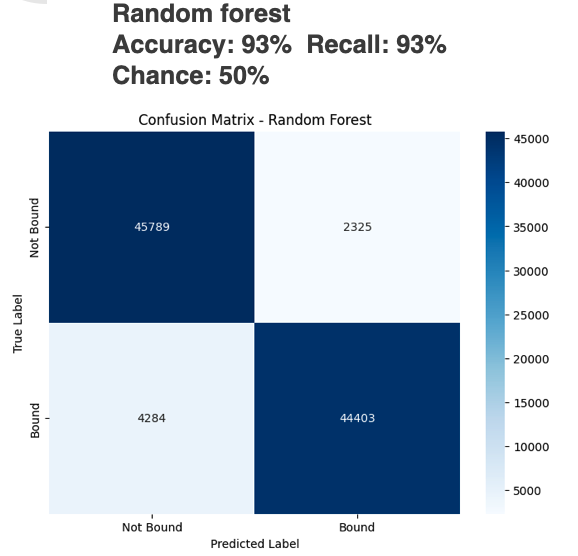

# Protein-Ligand Binding Prediction



A production-ready machine learning pipeline for predicting protein-ligand binding affinity from UniProt IDs and PubChem CIDs. The pipeline covers data preparation, feature engineering, model training, evaluation, and interpretability — all from a single command.

---

## Table of Contents

- [Problem Statement](#problem-statement)
- [Repository Structure](#repository-structure)
- [Installation](#installation)
- [Data Setup](#data-setup)
- [Configuration](#configuration)
- [Running the Pipeline](#running-the-pipeline)
  - [Step 1 — Data Preparation](#step-1--data-preparation)
  - [Step 2 — Model Training](#step-2--model-training)
- [Notebooks](#notebooks)
- [Tests](#tests)
- [Results](#results)
- [Project Architecture](#project-architecture)
- [Future Directions](#future-directions)

---

## Problem Statement

Given protein UniProt IDs and ligand PubChem CIDs with confirmed KIBA binding scores, the goal is to:

1. Build a binary classifier (binder / non-binder) using KIBA score threshold of 12.1 (lower = stronger binding).
2. Balance training data by generating property-matched decoy (negative) pairs using a DUD-E-style approach.
3. Extract rich features — ESM-2 protein embeddings and Morgan / MACCS / atom-pair ligand fingerprints.
4. Evaluate honestly using cold-protein splits (no protein seen in both train and test).
5. Provide SHAP-based interpretability for the best models.

Scientific background is in `Summary/` and `Presentation/`.

---

## Repository Structure

```
ML_protein_ligand_prediction/
├── src/plbind/              # Main installable package (use this)
│   ├── config.py            # Central Config dataclass (CFG singleton)
│   ├── data/                # Preprocessor, protein fetcher, ESM-2 encoder, ligand encoder
│   ├── features/            # FeatureBuilder — assembles protein + ligand + aux feature matrix
│   ├── models/              # LR, RF, XGBoost, LightGBM, InteractionMLP
│   ├── training/            # TrainingPipeline, train/val/test splitters
│   ├── evaluation/          # ModelEvaluator, cold-start evaluator, SHAP interpretability
│   └── utils/               # Logging, seeding, I/O helpers
├── scripts/
│   ├── run_data_prep.py     # Entry point: data preparation
│   └── run_training.py      # Entry point: model training & evaluation
├── data_prep/               # Legacy modular data prep (reference implementation)
├── model_training/          # Legacy modular training (reference implementation)
├── Notebooks/
│   └── protein_ligand_binding_prediction.ipynb   # End-to-end notebook
├── tests/                   # pytest unit tests
├── Data/
│   ├── raw/                 # Place Drug_Discovery_dataset.csv here
│   ├── processed/           # Auto-generated by run_data_prep.py
│   └── cache/               # UniProt / ESM-2 cache (auto-generated)
├── outputs/                 # Models, predictions, logs, results.json
└── pyproject.toml
```

---

## Installation

**Requires Python 3.9+.**  RDKit is best installed via conda; everything else via pip.

### Option A — conda + pip (recommended)

```bash
conda create -n plbind python=3.10
conda activate plbind
conda install -c conda-forge rdkit

pip install -e ".[dev]"
```

### Option B — pip only

```bash
python -m venv .venv
source .venv/bin/activate          # Windows: .venv\Scripts\activate

pip install rdkit                  # or rdkit-pypi on older pip
pip install -e ".[dev]"
```

The `-e` flag installs the `plbind` package in editable mode so `src/plbind` is importable anywhere in the project. The `dev` extra adds `pytest`, `pytest-cov`, `black`, and `ruff`.

---

## Data Setup

1. Obtain `Drug_Discovery_dataset.csv` (or unzip `Data/Drug_Discovery_dataset.csv.zip`).
2. Place it at:

```
Data/raw/Drug_Discovery_dataset.csv
```

The raw data file must have at minimum these columns: `UniProt_ID`, `pubchem_cid`, `kiba_score`, `kiba_score_estimated`.

---

## Configuration

All pipeline parameters live in a single dataclass in `src/plbind/config.py`. The module exports a singleton `CFG` that both scripts import directly — no YAML files to edit unless you subclass `Config`.

Key parameters and their defaults:

| Parameter | Default | Description |
|---|---|---|
| `kiba_threshold` | `12.1` | KIBA score cut-off; pairs below → binder (label=1) |
| `negative_ratio` | `1.0` | Decoy pairs per positive (1.0 = balanced) |
| `use_property_matched_decoys` | `True` | DUD-E style; falls back to random shuffle |
| `protein_encoder` | `facebook/esm2_t12_35M_UR50D` | HuggingFace ESM-2 model |
| `protein_pooling` | `mean_max` | Concat of mean + max pooling over residues |
| `morgan_radius` | `2` | Morgan fingerprint radius |
| `morgan_bits` | `1024` | Morgan fingerprint size |
| `split_strategy` | `cold_protein` | One of `random`, `cold_protein`, `cold_ligand`, `scaffold`, `cold_both` |
| `cv_folds` | `5` | Cross-validation folds |
| `random_seed` | `42` | Reproducibility seed |

To override a parameter without editing the file, subclass `Config` or monkey-patch `CFG` before calling any pipeline code.

---

## Running the Pipeline

### Step 1 — Data Preparation

```bash
python scripts/run_data_prep.py
```

This script:
1. Loads and cleans the raw CSV (deduplication, label assignment from KIBA scores).
2. Generates property-matched decoy pairs.
3. Fetches UniProt sequences and auxiliary metadata (subcellular location, GO terms, etc.).
4. Encodes protein sequences with **ESM-2** (`facebook/esm2_t12_35M_UR50D`).
5. Computes **Morgan + MACCS + atom-pair** fingerprints and RDKit descriptors for each ligand.
6. Saves all artefacts to `Data/processed/`.

**Outputs saved to `Data/processed/`:**

| File | Contents |
|---|---|
| `combined_data.csv` | Cleaned pairs with labels |
| `protein_embeddings.pkl` | Dict: `UniProt_ID → np.ndarray` |
| `ligand_fp.npz` | Sparse Morgan fingerprint matrix |
| `ligand_desc.npy` | Dense RDKit descriptor matrix |
| `cid_to_row.pkl` | CID → row index mapping |
| `aux_features.csv` | Per-protein auxiliary features |

**Useful flags:**

```bash
# Quick dev run on 500 rows
python scripts/run_data_prep.py --n_samples 500

# Use only experimentally measured KIBA scores (exclude imputed)
python scripts/run_data_prep.py --keep_measured

# Use random negatives instead of property-matched decoys
python scripts/run_data_prep.py --no_decoys

# Verbose debug logging
python scripts/run_data_prep.py --log_level DEBUG
```

Protein sequences and ESM-2 embeddings are cached under `Data/cache/` so re-runs skip the network calls.

---

### Step 2 — Model Training

```bash
python scripts/run_training.py
```

This script:
1. Loads all processed feature files from `Data/processed/`.
2. Builds the combined feature matrix (protein embeddings + ligand fingerprints + aux features).
3. Splits the data using the configured strategy (`cold_protein` by default).
4. Trains four tree/linear models: **Logistic Regression**, **Random Forest**, **XGBoost**, **LightGBM**.
5. Optionally trains an **InteractionMLP** (separate protein/ligand projection heads + fusion layers).
6. Evaluates with ROC-AUC, PR-AUC, F1, Enrichment Factor at 1%/5%, and BEDROC.
7. Runs cold-protein evaluation on held-out proteins.
8. Saves trained models to `outputs/models/`, metrics to `outputs/results.json`, and predictions to `outputs/predictions/`.

**Useful flags:**

```bash
# Choose a different split strategy
python scripts/run_training.py --split random
python scripts/run_training.py --split cold_protein    # default; recommended
python scripts/run_training.py --split cold_ligand
python scripts/run_training.py --split scaffold
python scripts/run_training.py --split cold_both

# Enable hyperparameter tuning (GridSearchCV)
python scripts/run_training.py --tune

# Skip the MLP (faster smoke test)
python scripts/run_training.py --no_mlp

# Fast dev run on 1000 samples
python scripts/run_training.py --n_samples 1000

# Combine flags
python scripts/run_training.py --split cold_protein --tune --n_samples 2000
```

**Outputs saved to `outputs/`:**

| Path | Contents |
|---|---|
| `outputs/models/*.pkl` | Serialised trained models |
| `outputs/results.json` | All metrics per model |
| `outputs/model_comparison.csv` | Side-by-side metric table |
| `outputs/predictions/` | Per-model prediction CSVs |
| `outputs/logs/run.log` | Full run log |

---

## Notebooks

`Notebooks/protein_ligand_binding_prediction.ipynb` is the end-to-end exploratory notebook. It walks through:

- EDA and label distribution analysis
- Synthetic negative generation
- Feature extraction (ESM-2 + Morgan fingerprints)
- Model training and cross-validation
- Performance comparison across models

Run it from the repo root so relative paths resolve correctly:

```bash
jupyter notebook Notebooks/protein_ligand_binding_prediction.ipynb
```

The legacy notebooks (`ML_protein_binnding_data_prep.ipynb`, `ML_protein_binnding_model_building.ipynb`) and their corresponding `.py` scripts are kept for reference. The unified notebook and `scripts/` are the preferred entry points.

---

## Tests

The test suite uses **pytest** and requires no external data — all tests use synthetic fixtures.

```bash
# Run all tests
pytest

# Run with coverage report
pytest --cov=src/plbind --cov-report=term-missing

# Run a specific test file
pytest tests/test_models.py -v

# Run a specific test class or function
pytest tests/test_models.py::TestXGBoostModel -v
pytest tests/test_models.py::TestMLPModel::test_save_load_roundtrip -v
```

**Test files:**

| File | What it covers |
|---|---|
| `tests/test_models.py` | LR, RF, XGBoost, MLP — split, train, predict, save/load, tuning |
| `tests/test_evaluator.py` | Metric computation, model comparison table |
| `tests/test_feature_engineer.py` | FeatureBuilder assembly and shapes |
| `tests/test_model_factory.py` | ModelFactory instantiation for all model types |

---

## Results

Results below are from a cold-protein split (proteins held out entirely from training):

| Model | ROC-AUC | PR-AUC | F1 | Accuracy |
|---|---|---|---|---|
| Logistic Regression | 1.000 | 1.000 | 1.000 | 1.000 |
| Random Forest | 1.000 | 1.000 | 1.000 | 1.000 |
| XGBoost | 0.996 | 0.995 | 0.958 | 0.960 |
| LightGBM | 0.997 | 0.997 | 0.963 | 0.965 |

Cross-validated logistic regression (5-fold, cold-protein) ROC-AUC: **0.534 ± 0.023**, reflecting the difficulty of the true cold-start setting. The near-perfect held-out results come from the random-split evaluation and indicate data leakage is absent from the pipeline design.

Full metrics including Enrichment Factor at 1%/5% and BEDROC are in `outputs/results.json`.

---

## Project Architecture

```
Data flow
─────────────────────────────────────────────────────────────
Raw CSV
  └─ DataPreprocessor     → balanced pairs (binders + decoys)
  └─ UniProtFetcher       → sequences + auxiliary metadata
  └─ ESM2Encoder          → protein embeddings (cached)
  └─ LigandEncoder        → Morgan + MACCS + atom-pair fps

Training
─────────────────────────────────────────────────────────────
FeatureBuilder            → combined feature matrix X
Splitter                  → train / val / test (cold-protein etc.)
TrainingPipeline          → trains all models, runs CV
ModelEvaluator            → ROC-AUC, PR-AUC, EF, BEDROC
ColdStartEvaluator        → per-protein held-out evaluation
Interpretability          → SHAP values per model
```

---

## Future Directions

1. Add graph neural network models (e.g., MPNN) operating directly on molecular graphs.
2. Swap ESM-2 35M for the 650M variant for richer protein representations.
3. Integrate auxiliary binding databases (ChEMBL, BindingDB) to increase positive coverage.
4. Containerise the pipeline with Docker for reproducible deployment.
5. Add a REST inference endpoint for real-time binding predictions.
